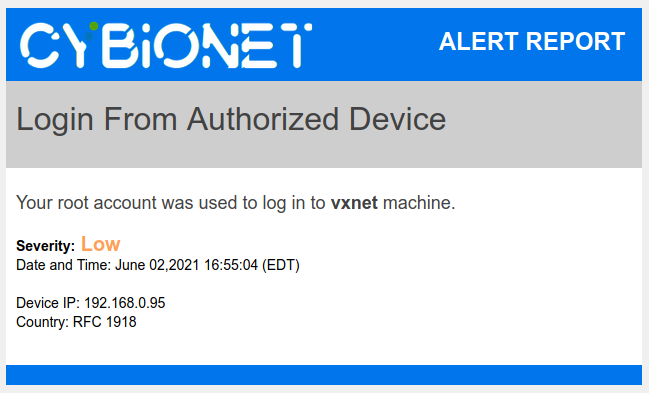
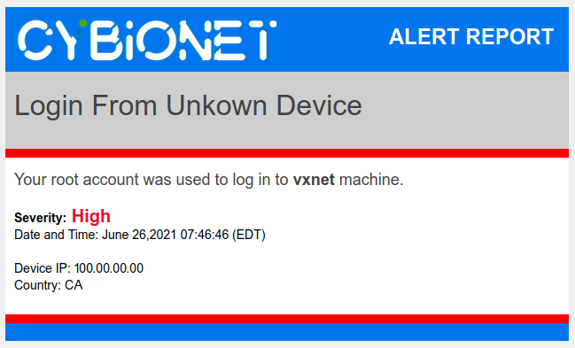

| ![alt text][logo] | Integration & Securite Systeme |
| ------------- |:-------------:|

# Login Alert
This script will send a email in HTML format at each authentication for one or several specific user.

## Screenshot

Example of an email alert with an authorized IP address.

Example of an email alert with an unauthorized IP address.

---
[logo]: ./md/logo.png "Cybionet"
