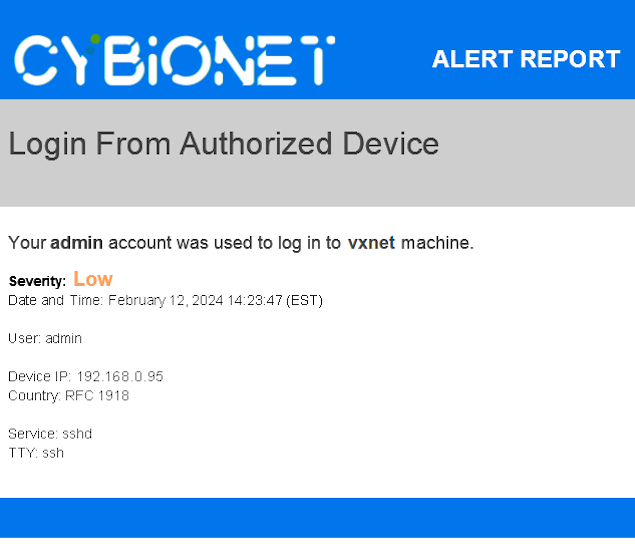
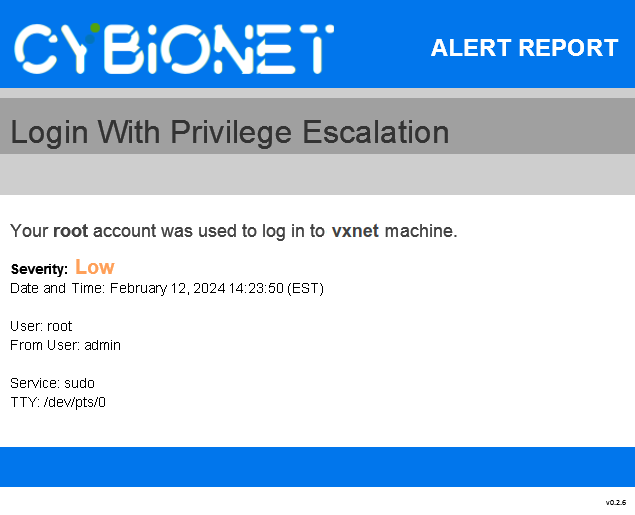

| ![alt text][logo] | Integration & Securite Systeme |
| ------------- |:-------------:|

# Cybionet - Ugly Codes Division

## SUMMARY

This script sends an email in HTML format at each authentication for one or several specific user.

You can apply the launch of this script for each of the PAM modules.

Recommended:
 - sshd
 - su
 - sudo

 

### Screenshot

Example of an email alert with an authorized IP address.

Example of an email alert with an unauthorized IP address.

 

## REQUIRED

The `loginalert` application requires the following additional packages to work.

 Use `apt-get` command to install these dependencies.
 - mutt
 - whois
 - gpgsm

 

## INSTALLATION

[Installation and Configuration](INSTALL.md) 

---
[logo]: ./md/logo.png "Cybionet"
